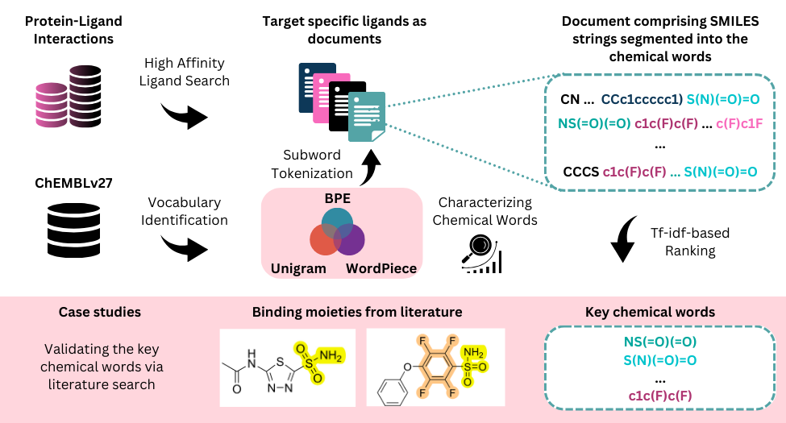
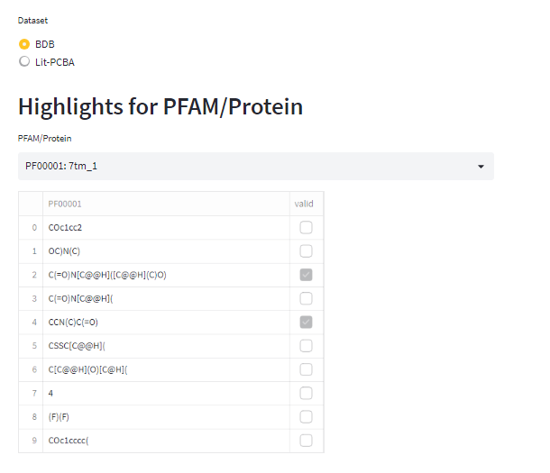
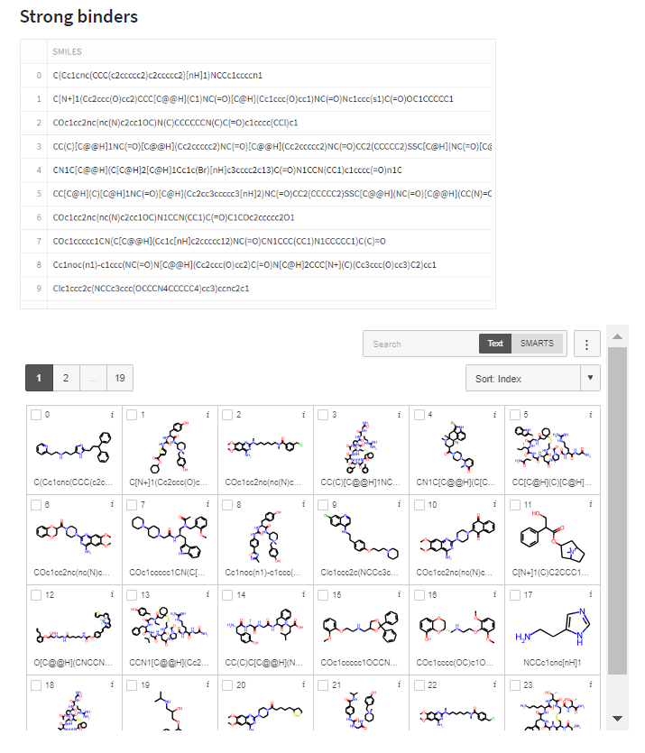
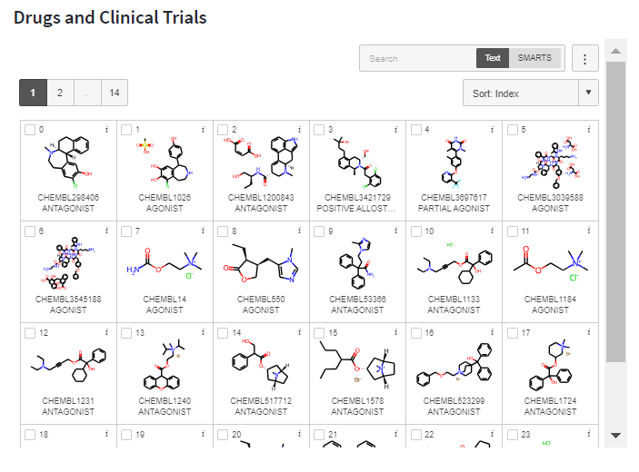

# Exploring Data-Driven Chemical SMILES Tokenization Approaches to Identify Key Protein-Ligand Binding Moieties



## About
This repository contains code for "Exploring Data-Driven Chemical SMILES Tokenization Approaches to Identify Key Protein-Ligand Binding Moieties". The accompanying materials are available in Zenodo DOI.


## Installation
To use the scripts, clone the repository and install the required dependencies:

```bash
git clone https://github.com/boun-tabi/exploring-chemical-words.git
cd exploring-chemical-words
pip install -r requirements.txt
```

## Usage

### Identifying chemical vocabularies
Train subword tokenization models to identify chemical vocabularies.

```bash
python word_identification.py --model_type [model_type] --corpus [corpus_path] --save_name [save_name] --vocab_size [vocab_size]
```

* `--model_type`: Choose from 'bpe', 'unigram', 'wordpiece'
* `--corpus`: Filepath of the corpus containing SMILES strings
* `--save_name`: Filename for the output vocabulary file
* `--vocab_size`: Desired size of the vocabulary


### Selecting key chemical words
Identify significant words in chemical documents using the specified vocabulary.


```bash
python highlighter.py --dataset [dataset_name] --vocabulary [vocabulary_name]
```

* `--dataset`: Specify dataset name (e.g., 'lit_pcba', 'bdb', or others)
* `--vocabulary`: Name or path of the vocabulary file


### Computing chemical vocabulary statistics 
Perform a comprehensive analysis of chemical words, deriving key statistics and insights.

```bash
python analyzer.py --dataset [dataset_name] --vocabulary [vocabulary_name]
```
* `--dataset`: Choose the dataset (e.g., 'lit_pcba', 'bdb', or others)
* `--vocabulary`: Name or path of the vocabulary file


### Streamlit app
Launch an interactive Streamlit application illustrating the key chemical words for particular targets along with associated binders and drugs.
```bash
streamlit run app.py
```





